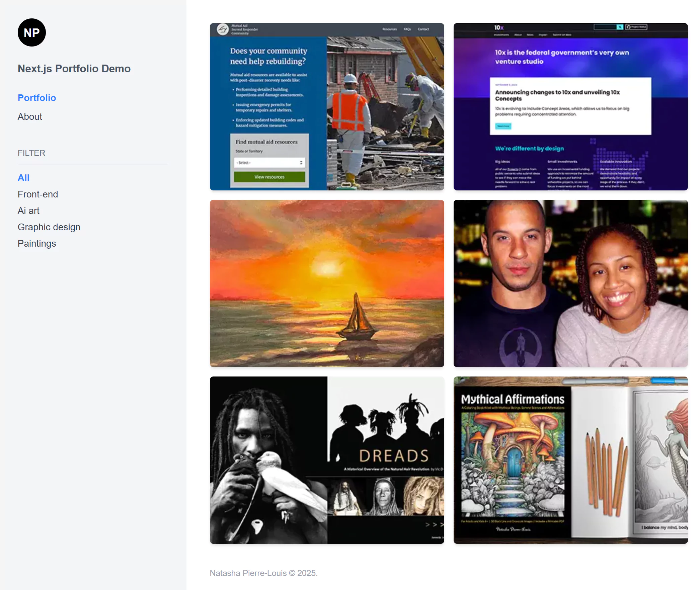

# Next.js Portfolio Demo

A modern **portfolio website** built with **Next.js**, **Tailwind CSS**, and **Contentful** as a headless CMS.  
This project serves as a **learning exercise** in **Next.js 13+**, **app router**, **SSG/SSR**, **dynamic routing**, and **client/server components**.

 <!-- Add an image of your portfolio here -->

## Features
- **Next.js App Router** – Learning **Static Site Generation (SSG)** & **Server Components**
- **Tailwind CSS** – Rapid UI styling
- **Contentful CMS** – Managing portfolio projects dynamically
- **Client-side Filtering** – Using React state for project filtering
- **Dynamic Routing** – Individual project pages using **`/project/[slug]`**
- **Markdown Support** – Using `marked` to render project descriptions
- **SEO Optimized** – Metadata, accessible structure, and performant Next.js features

---

## **Tech Stack**
| **Technology**  | **Purpose** |
|---------------|------------|
| **Next.js** | React framework with SSR, SSG, API Routes |
| **Tailwind CSS** | Utility-first CSS framework for styling |
| **Contentful CMS** | Headless CMS to store projects dynamically |
| **GraphQL** | Fetching data from Contentful |
| **Marked.js** | Converting markdown to HTML |

---

## **Demo**
🔗 [Live Demo](https://your-demo-link.com)

---

## **Getting Started**
### **1️⃣ Clone the Repository**
```sh
git clone https://github.com/your-username/nextjs-portfolio-demo.git
cd nextjs-portfolio-demo
```

### **2️⃣ Install Dependencies**
```sh
npm install
```

### **3️⃣ Set Up Environment Variables**
Create a `.env.local` file in the root folder and add your **Contentful API keys**:
```sh
CONTENTFUL_SPACE_ID=your_space_id
CONTENTFUL_ACCESS_TOKEN=your_access_token
```
🔹 Get these from your **Contentful Dashboard → Settings → API Keys**.

### **4️⃣ Run the Development Server**
```sh
npm run dev
```
Your site is now running at **`http://localhost:3000`** 🚀.

---

## **Project Structure**
```
nextjs-portfolio-demo/
│── src/app/                # Next.js App Router
│   ├── components/         # Reusable UI components (Sidebar, Portfolio, etc.)
│   ├── context/            # Filter Context for project filtering
│   ├── lib/                # Contentful API functions
│   ├── project/[slug]/     # Dynamic project detail pages
│   ├── page.tsx            # Home Page (Portfolio List)
│   ├── layout.tsx          # Root Layout (Sidebar + Global Structure)
│── public/                 # Static assets (images, favicons, etc.)
│── styles/                 # Global styles (Tailwind base configs)
│── .env.local              # API keys (ignored in Git)
│── README.md               # Project documentation
│── next.config.js          # Next.js Configuration
│── tailwind.config.js      # Tailwind CSS Configuration
│── tsconfig.json           # TypeScript Config
│── package.json            # Project Dependencies
```

---

## **What I Learned**
✔️ **Next.js App Router** – Using Server Components, layouts, and dynamic routes  
✔️ **Static Site Generation (SSG)** – Pre-rendering pages with `getStaticProps()`  
✔️ **Fetching Data with GraphQL** – Using Contentful as a headless CMS  
✔️ **Tailwind CSS for Styling** – Creating a responsive, minimal UI  
✔️ **Client-side State Management** – Filtering projects with React state  
✔️ **Markdown Rendering** – Converting markdown content to HTML dynamically  

---

## **Deployment**
Deployed on **Vercel** (recommended for Next.js apps).

### **Deploy on Vercel (Free)**
1. **Sign up** on [Vercel](https://vercel.com/)
2. **Connect your GitHub repo** and deploy!
3. **Add `.env.local` environment variables** in the Vercel dashboard.

---

## **Contributing**
This project is a learning exercise, but feel free to **open issues or suggest improvements**!

---

## **Author**
👩‍💻 **Natasha Pierre-Louis**  
🔗 [GitHub](https://github.com/natashapl) • 🌐 [Portfolio](https://www.natashasfolio.com/)

---

## **Support**
If you like this project, **please give it a ⭐ on GitHub**! 😊

---